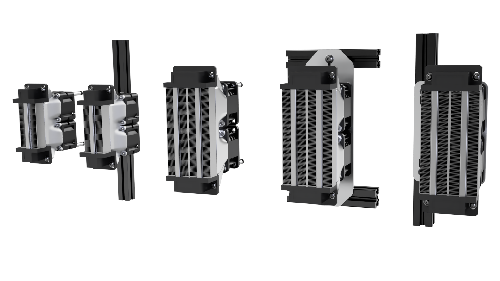

# SLM Chamber Heater Ducts
> [!CAUTION]
> **Be careful with live wiring and hot parts! The Monolith team is not responsible for any mishandling error that might result in damage or harm.**
>
> **Always monitor the chamber heater fin temperature with a cartridge or an M3 thermistor.**

## What's this?

Simple SLM ducts with mounting solutions for the common 500W and 100W PTC heaters.

> [!NOTE]
> **If you have questions or want to stay more up-to-date with Monolith, consider joining the dedicated Discord server.**
>
> 
>
> **If you would like to see more of this and other projects in the future, consider supporting us on Ko-fi.**
>
> 
