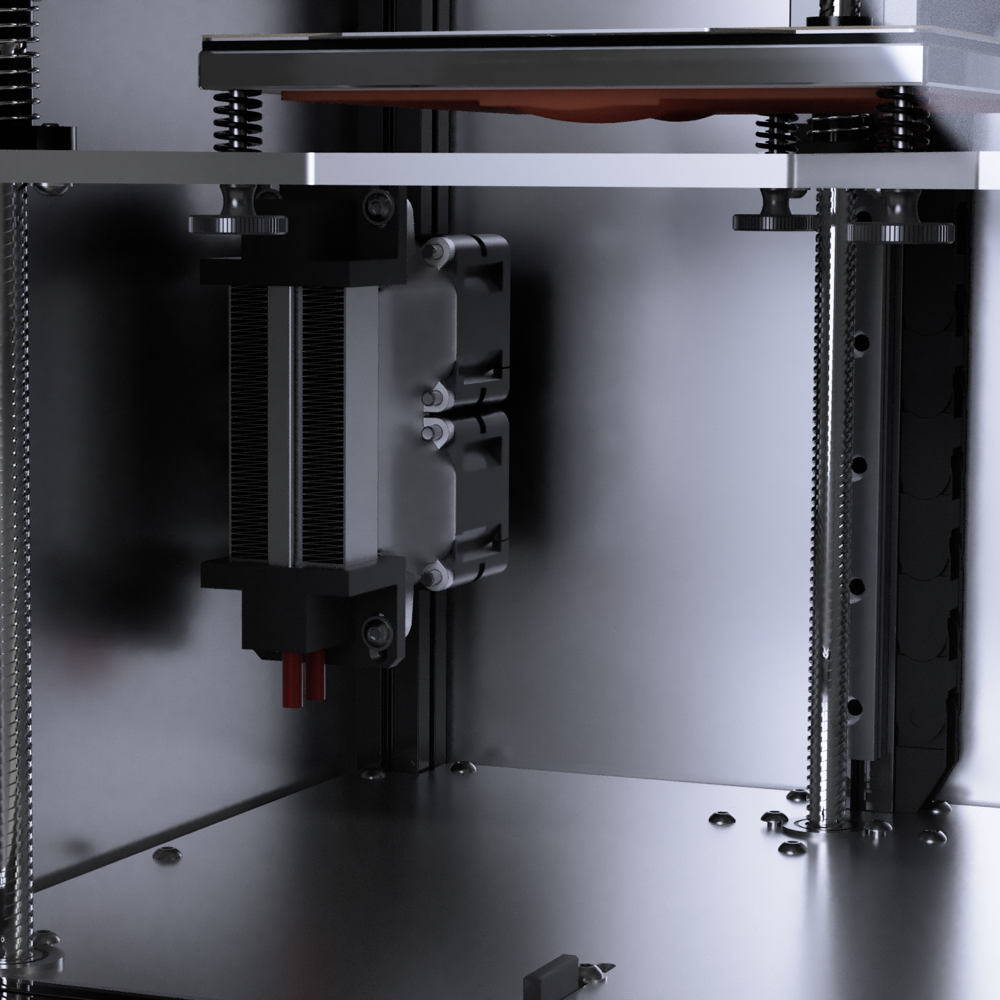
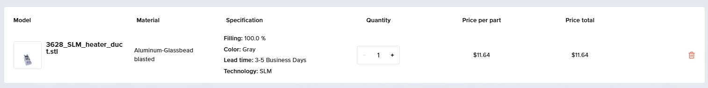
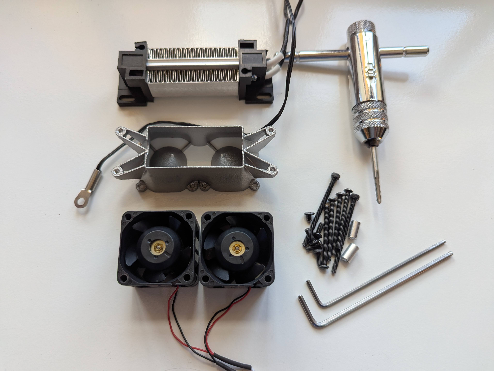
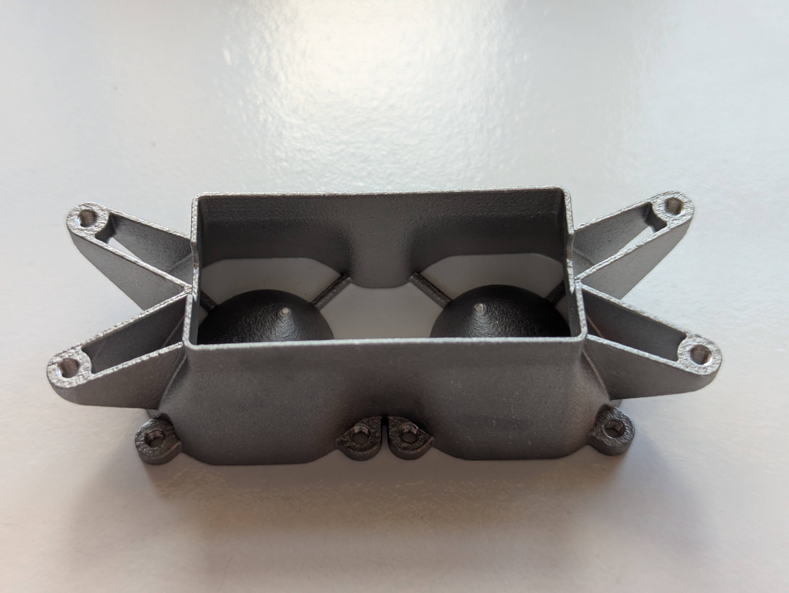
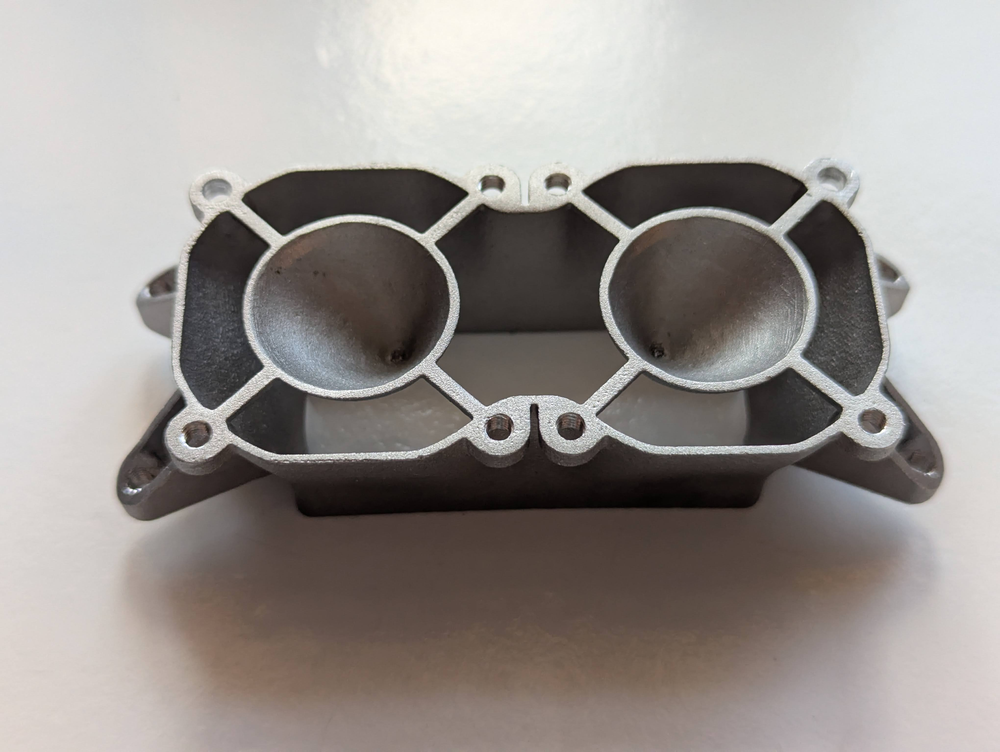
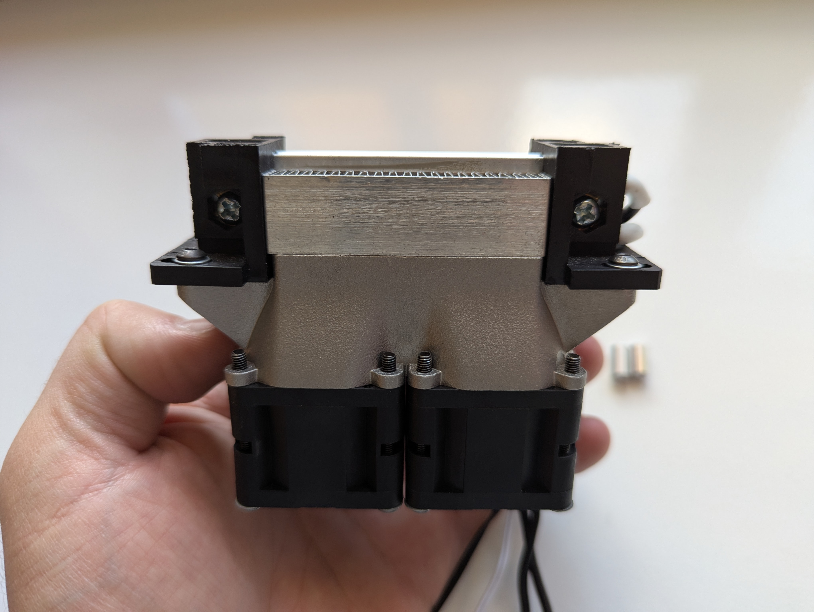
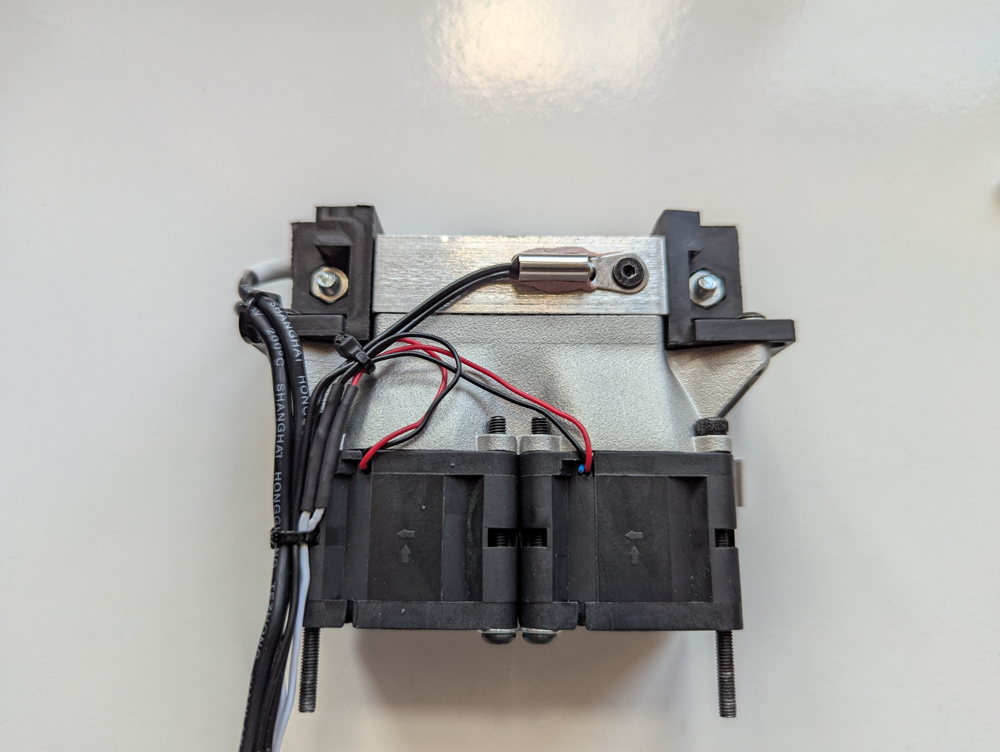

# SLM Chamber Heaters

## What's this?

Simple Chamber Heater mounts and ducts for PFA

Chamber temperature is key for optimal printing of ABS and other plastics. A chamber heater lets you easily control the air temperature, but requires careful considerations for a safe installation.

This SLM mount lets you secure the heater with only metal, ensuring that even in case of a runaway heater the mount doesn't melt. It is supposed to be paired with 3628 fans with good temperature resistance, like the deltas, that also achieve a high level of airflow.
The SLM part is not expensive, so it's an easy addition to any SLM order you want to make.

The BOM is:
- 1x [PTC Heater 100W 98x32mm](https://a.aliexpress.com/_EuRa9U2);
- 2x 3628 fans;
- 6x M3x35mm BHCS;
- 2x M3x45mm BHCS;
- 2x M3 T-Nuts;
- 2x M3x10mm Spacers (not threaded)

### BE CAREFUL WITH LIVE WIRING AND HOT PARTS! The Monolith team is not responsible for any mishandling error that might result in damage or harm.

> [!NOTE]
> **If you have questions or want to stay more up-to-date with Monolith, consider joining the dedicated Discord server.**
>
> 
>
> **If you would like to see more of this and other projects in the future, consider supporting me on Ko-fi.**
>
> 
