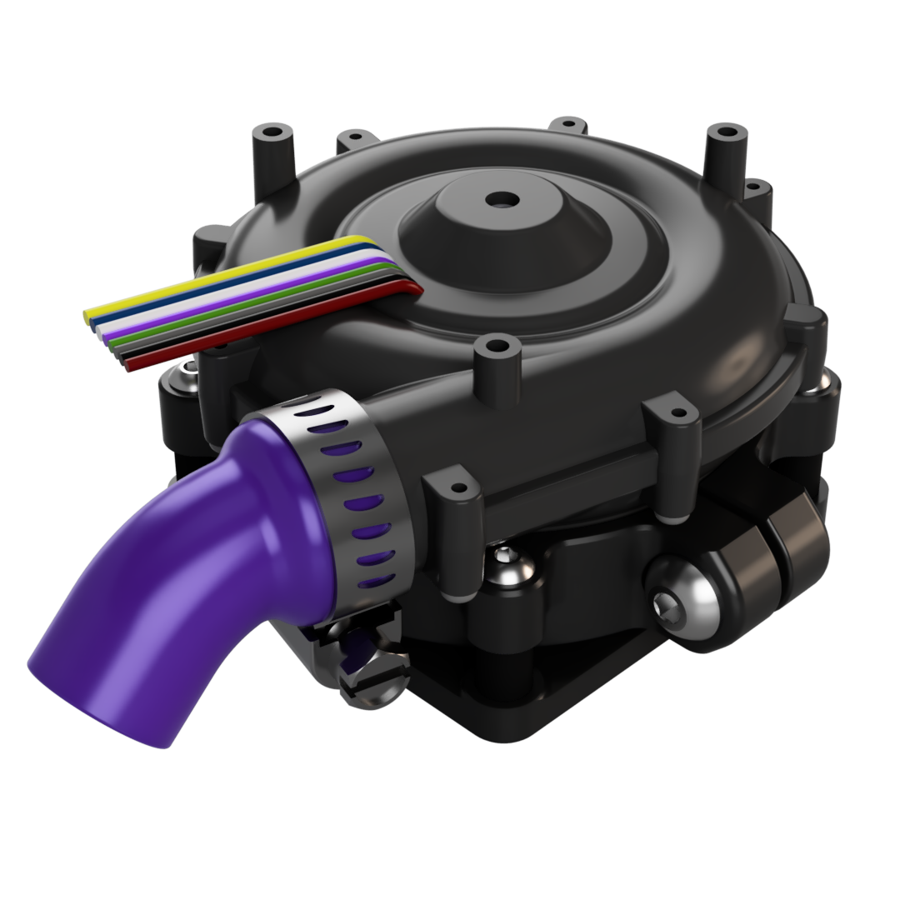

# WS7040 Anti-Vibration Mount

## What's this?
Have you ever noticed that if you hold a CPAP blower in your hand or hang it mid-air, it’s much quieter than when it’s rigidly mounted to your printer?

This project focuses on isolating mechanical vibration by implementing widely used, proven principles from similar applications, such as vacuum cleaners.

This is NOT a muffler.

This is NOT a complete “CPAP box” for the WS7040. This is a mounting solution that you have to integrate into your existing setup.

## Design goals
- Minimize unsprung mass attached to the blower
- Centered clamping ring at the imbalance height to constrain motion mostly to the XY plane
- XY-compliant isolation (rubber bushings) while keeping Z relatively stiff for reliable intake sealing
- Barely-compressed thick foam edge gasket

> [!IMPORTANT]
> **Do NOT use rigid piping between the printer and the WS7040 exhaust, as vibration isolation will suffer. Either use a short piece of flexible CPAP tube between the passthrough and the WS7040, or connect the tube directly.**

## BOM
- 4 × M3 rubber anti-vibration standoffs (drone style)
  - [AliExpress link](https://www.aliexpress.com/item/1005003571892975.html)
  - [Amazon link](https://www.amazon.com/QWINOUT-Anti-Vibration-Screws-Controller-Mounting/dp/B07ZNJFJNT)
- 1 × Steel hose clamp (~20 mm OD)
- 4 × M3×10 BHCS
- 4 × M3×D5×4 heat-set inserts
- 1 × M5×16 BHCS
- 3 mm thick foam tape (Voron style)

> [!NOTE]  
> **If you have questions or want to stay more up-to-date with Monolith, consider joining the dedicated Discord server.**
> 
>   
>  
> **If you would like to see more of this and other projects in the future, consider supporting Monolith on Patreon.**
> 
> 
